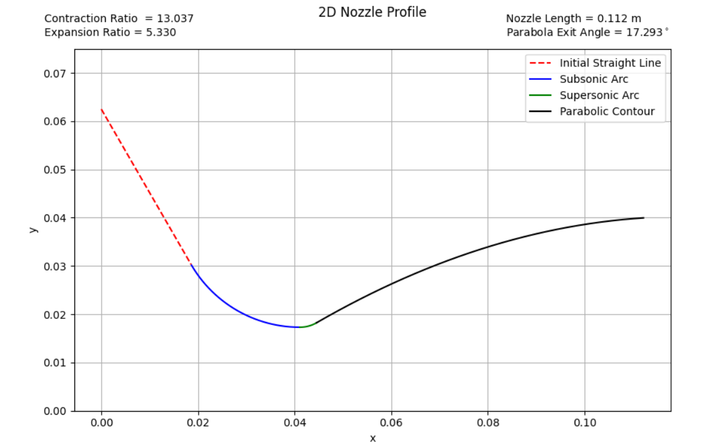
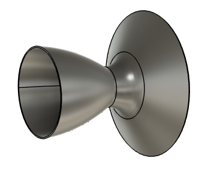
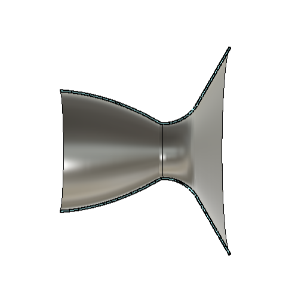
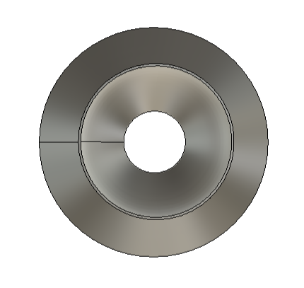
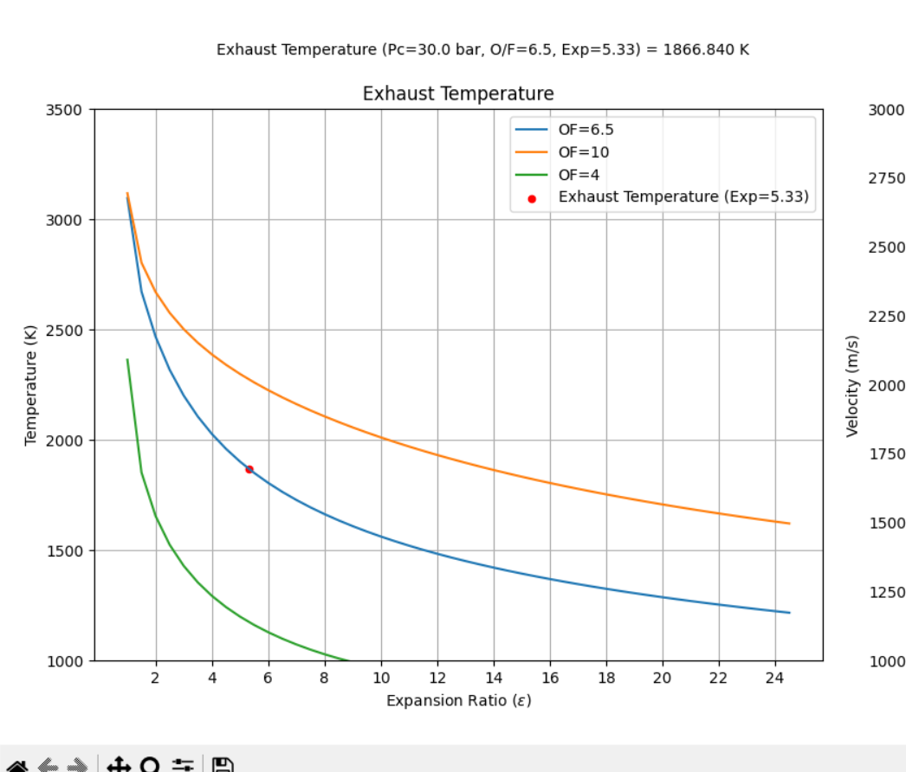
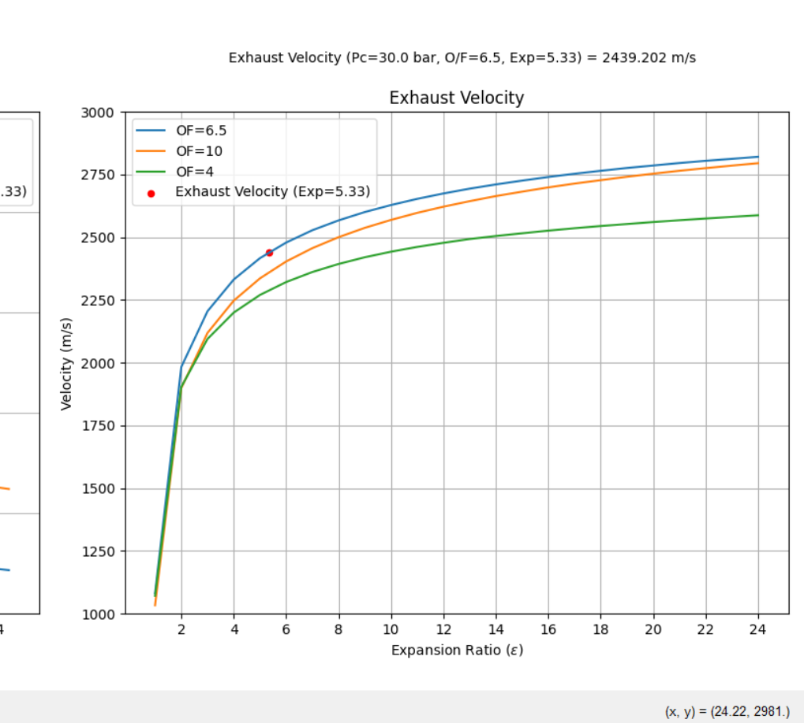
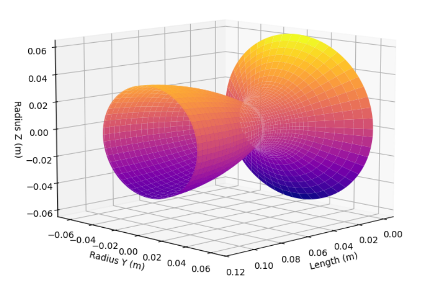
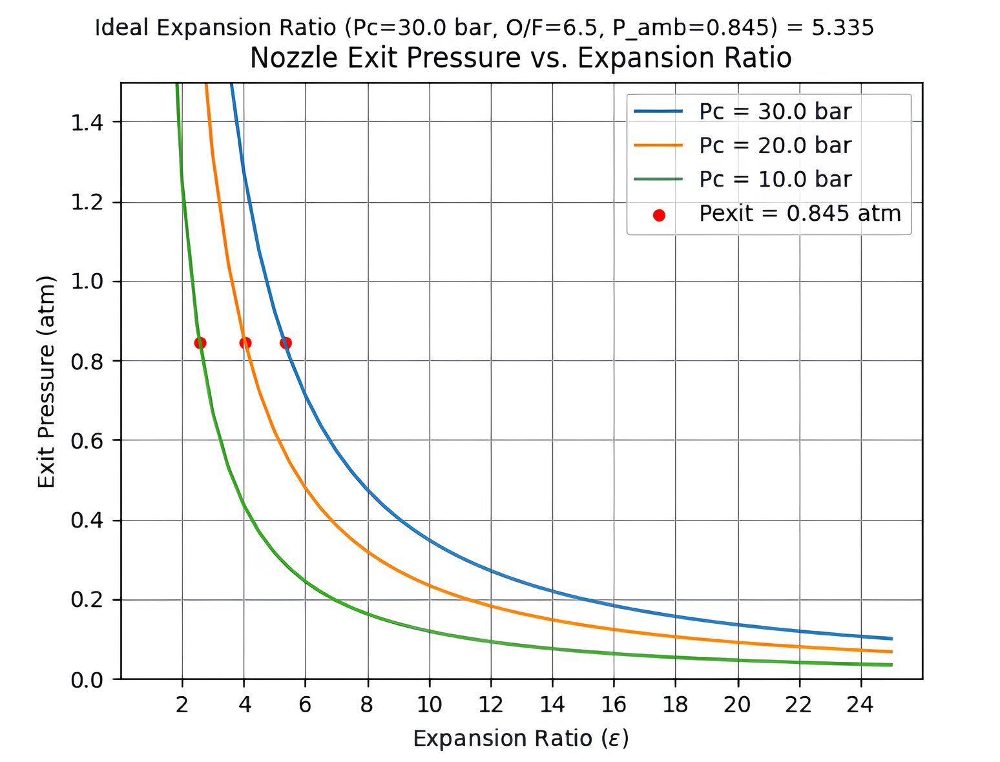
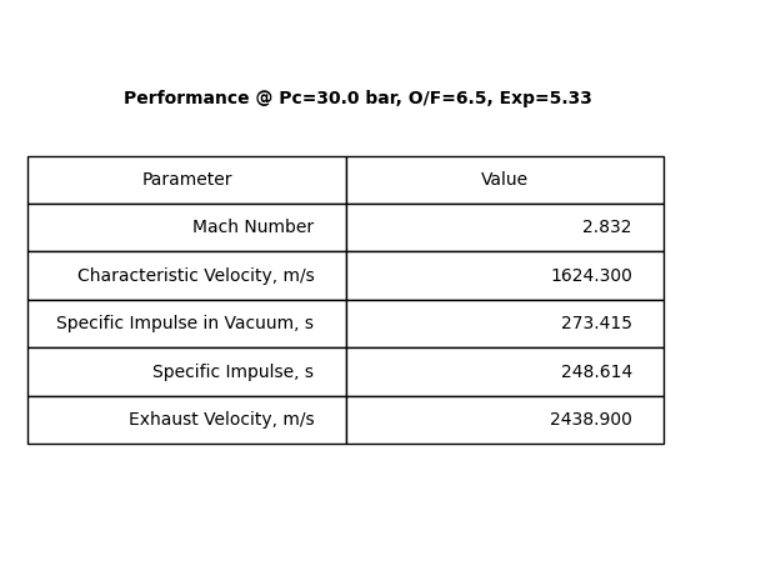
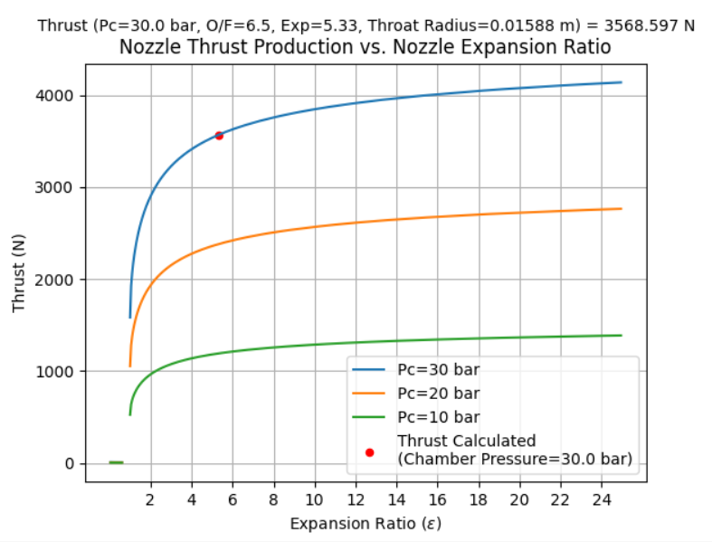

# Rocket Nozzle Geometry Simulator

This simulator was made using Python, having an interface in Java. It was developed to simulate the **ideal geometry of a rocket nozzle**. It allows the user to:

- Plot the geometry profile in a 2D graphic and preview the geometry in a 3D plot;
- Calculate the ideal throat radius;
- Plot the ideal expansion ratio to maximize thrust for various chamber pressures;
- Plot performance parameters (Specific Impulse, Thrust, Mach number, etc.) for various O/F ratios;
- Plot exhaust parameters (exhaust temperature and velocity) for different chamber pressures;
- In the 2D plot, the contraction ratio, parabola exit angle, and nozzle length are displayed on the graphic;

> Currently, the simulator has been used to design the nozzle geometry for a **hybrid rocket** using mainly **paraffin wax** as fuel and **N₂O** as oxidizer to compete at EuRock 2025 with Porto Space Team.

---

<table>
<tr>
<td align="center" width="50%">

<b>2D Geometry Plot</b> 
  

<b>AutoDesk Fusion Model</b> 
 

  

<b>Exhaust Temperature</b> 
 

<b>Exhaust Velocity</b> 
  

</td>
<td align="center" width="50%">

<b>3D Geometry Preview</b> 
  

<b>Getting Ideal Expansion Ratio</b> 
  

<b>Performance Parameters</b> 
  

<b>Thrust Analysis</b> 
 

</td>
</tr>
</table>
